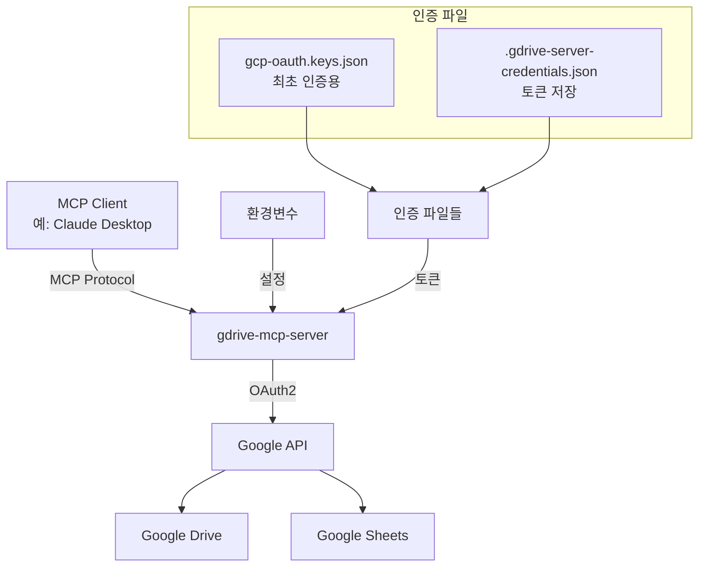

# Google Drive MCP Server 프로젝트 정보

## 프로젝트 개요
- **패키지명**: @pghoya2956/gdrive-mcp-server
- **GitHub 저장소**: https://github.com/pghoya2956/gdrive-mcp-server
- **npm**: https://www.npmjs.com/package/@pghoya2956/gdrive-mcp-server
- **설명**: Model Context Protocol (MCP)을 통해 Google Drive와 Google Sheets에 접근하는 서버
- **작성자**: pghoya2956

## 주요 아키텍처



## 인증 메커니즘
1. **최초 인증**: `gcp-oauth.keys.json` 파일로 브라우저 인증 시작
2. **토큰 저장**: `.gdrive-server-credentials.json`에 access/refresh 토큰 저장
3. **토큰 갱신**: 환경변수 `CLIENT_ID`/`CLIENT_SECRET`으로 자동 갱신
4. **백그라운드 갱신**: 45분마다 토큰 유효성 확인 및 갱신

## 접근 범위 제어
- `GDRIVE_ROOT_FOLDER_ID`로 지정된 폴더와 하위 폴더만 접근
- 내 드라이브와 공유 드라이브 모두 지원
- `supportsAllDrives: true` API 옵션으로 모든 드라이브 유형 지원

## 설치 방법
```bash
# npm으로 설치
npm install git+https://github.com/pghoya2956/gdrive-mcp-server.git

# 또는 npm 레지스트리에서 (퍼블리싱 후)
npm install @pghoya2956/gdrive-mcp-server
```

## 주요 도구
- `gdrive_search`: 파일 검색
- `gdrive_read_file`: 파일 읽기
- `gdrive_read_large_file`: 대용량 파일 읽기
- `gdrive_folder_structure`: 폴더 구조 탐색
- `gdrive_analyze_image`: 이미지 분석
- `gsheets_read`: 스프레드시트 읽기
- `gsheets_update_cell`: 셀 업데이트