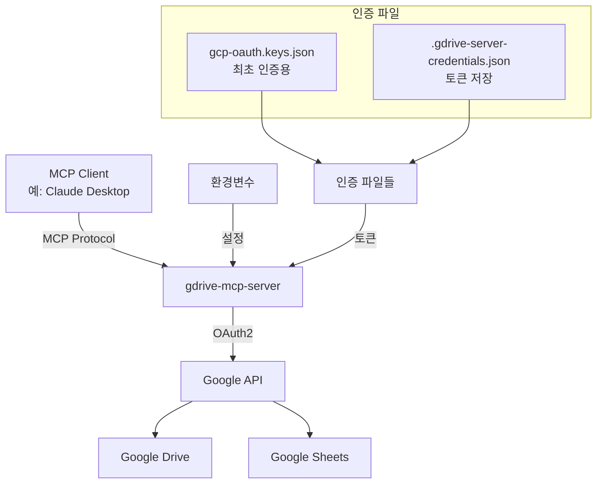

# Google Drive MCP Server 프로젝트 정보

## 프로젝트 개요
- **패키지명**: @pghoya2956/google-drive-mcp-server
- **GitHub 저장소**: https://github.com/pghoya2956/Google-Drive-MCP-Server
- **npm**: https://www.npmjs.com/package/@pghoya2956/google-drive-mcp-server
- **설명**: Model Context Protocol (MCP)을 통해 Google Drive와 Google Sheets에 접근하는 서버
- **작성자**: pghoya2956

## 주요 아키텍처



## 인증 메커니즘
1. **최초 인증**: `gcp-oauth.keys.json` 파일로 브라우저 인증 시작
2. **토큰 저장**: `.gdrive-server-credentials.json`에 access/refresh 토큰 저장
3. **토큰 갱신**: 환경변수 `CLIENT_ID`/`CLIENT_SECRET`으로 자동 갱신
4. **백그라운드 갱신**: 45분마다 토큰 유효성 확인 및 갱신

## 접근 범위 제어
- `GDRIVE_ROOT_FOLDER_ID`로 지정된 폴더와 하위 폴더만 접근
- 내 드라이브와 공유 드라이브 모두 지원
- `supportsAllDrives: true` API 옵션으로 모든 드라이브 유형 지원

## 설치 방법
```bash
# npm으로 설치
npm install git+https://github.com/pghoya2956/Google-Drive-MCP-Server.git

# 또는 npm 레지스트리에서 (퍼블리싱 후)
npm install @pghoya2956/google-drive-mcp-server
```

## 주요 도구
- `gdrive_search`: 파일 검색
- `gdrive_read_file`: 파일 읽기 (PDF 메타데이터 추출 기능 포함)
- `gdrive_read_large_file`: 대용량 파일 읽기
- `gdrive_folder_structure`: 폴더 구조 탐색
- `gdrive_analyze_image`: 이미지 분석
- `gsheets_read`: 스프레드시트 읽기
- `gsheets_update_cell`: 셀 업데이트

## PDF 파일 지원 (v0.3.0)

### 기능
- **텍스트 추출**: pdf-parse 라이브러리를 사용한 텍스트 추출
- **메타데이터**: 페이지 수, 파일 크기, 제목, 작성자, 생성일 등
- **구조화된 응답**: JSON 형식으로 텍스트와 메타데이터 분리 제공

### 제한사항
- 최대 20MB 파일 크기 제한 (Google Drive API 제약)
- 암호화된 PDF 미지원
- 스캔된 이미지 PDF 텍스트 추출 불가
- OCR 기능 없음

### 개선된 에러 처리
- 파일 크기 초과 시 명확한 안내 메시지
- 암호화/스캔 PDF에 대한 사용자 친화적 오류 메시지
- 각 오류 유형에 대한 해결 방법 제안

## PDF 캐싱 기능 (v0.3.0)

### LRU 캐시 구현
- **메모리 제한**: 100MB 최대 크기
- **TTL**: 30분 자동 만료
- **캐시 키**: fileId + modifiedTime 조합
- **정리**: 10분마다 만료된 항목 자동 제거

### 성능 향상
- 반복적인 PDF 요청 시 즉각적인 응답
- 네트워크 대역폭 절약
- Google Drive API 호출 횟수 감소

### 구현 세부사항
- `tools/cache.ts`: LRU 캐시 클래스
- `tools/gdrive_read_file.ts`: PDF 읽기 시 캐싱 로직
- `index.ts`: 주기적 캐시 정리 및 통계 로깅

## PDF 테이블 추출 기능 (v0.4.0)

### 구현 개요
- **pdf.js-extract**: 좌표 기반 텍스트 추출
- **테이블 감지**: 행/열 정렬 및 구조 분석
- **다중 형식 지원**: Markdown 및 JSON 형식 출력

### 테이블 감지 알고리즘
1. Y 좌표로 텍스트 그룹화 (행 감지)
2. X 좌표로 열 정렬 확인
3. 연속된 행을 테이블로 그룹화
4. 첫 번째 행을 헤더로 처리

### 폴백 처리
- pdf-parse로 기본 텍스트 추출
- 테이블 추출 실패 시에도 텍스트 제공
- 사용자에게 자연스러운 경험 보장

### 구현 파일
- `tools/pdf-table-extractor.ts`: 테이블 추출 클래스
- `types/pdf.js-extract.d.ts`: 타입 정의